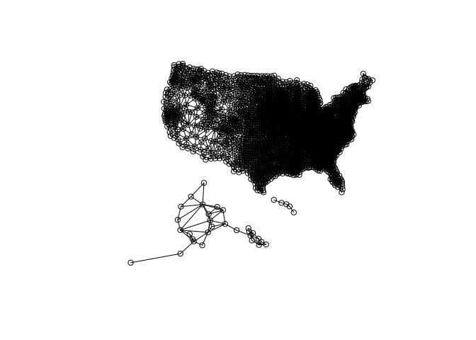

<!-- README.md is generated from README.Rmd. Please edit that file -->

# County Adjacency File

This repository contains the adjacency structure for US counties. The
information is stored in a `.rds` file, to be read into R using the
`Matrix` package as follows:

``` r
library(Matrix)
library(readr)
A <- readr::read_rds("county-connectivity.rds")
class(A)
#> [1] "dgCMatrix"
#> attr(,"package")
#> [1] "Matrix"
```

Or:

``` r
url <- "https://github.com/ConnorDonegan/county-adjacency/raw/main/county-connectivity.rds"
A <- readr::read_rds(url)
class(A)
#> [1] "dgCMatrix"
#> attr(,"package")
#> [1] "Matrix"
```

The county FIPS codes (GEOIDs) are strored in the column and row names
so that the adjacency structure can be properly aligned to other data
sets:

``` r
head(colnames(A))
#> [1] "31039" "53069" "35011" "31109" "31129" "46099"
head(rownames(A))
#> [1] "31039" "53069" "35011" "31109" "31129" "46099"
```

The file was created by calling `spdep::poly2nb` on the county shapefile
returned by `tigris::counties()`, dropping U.S. territories, and
connecting the islands of Hawaii to each other.

The following code visualizes the connectivity structure:

``` r
library(tigris)
library(sf)
sdf <- counties() %>%
    dplyr::filter(as.numeric(STATEFP) < 57) %>%
    shift_geometry(preserve_area = TRUE)

E <- Matrix::summary(Matrix::Matrix(A))
E <- E[which(E$i < E$j), ]
G <- list(np = nrow(A), # confrom to spdep graph structure, then back to nb to map it 
          from = E$i,
          to = E$j,
          nedges = nrow(E)
          )
class(G) <- "Graph"
nb <- spdep::graph2nb(G)
plot(nb, sf::st_geometry(sdf))
```


